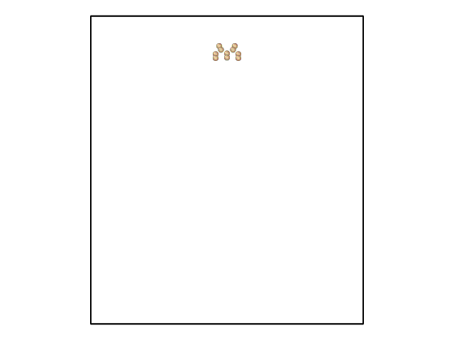

# Axiom Drives Scientific Computing Codes with Python

Authors: **aXioM**=**Xiao**Han+**Mo**Han :)

This framework helps bind (GPU/MPI-accelerated) C++ codes with Python using pybind11. For example, packages/mdsw implements Molecular Dynamics in C++ and it interfaces with OpenAI/gym environment through Python. New package can be added by following the existing examples. Axiom allows C++ and Python to communicate efficiently within memory through Numpy. Below shows an calculation done with mdsw -- the greedy search part is written in Python.

<figcaption> Minimum Atomistic Defect (Frank-Partial Dislocation) Nucleation Energy Barrier Found by Greedy Algorithm </figcaption>

## Installation requirement:
1) OS X > Yosemite, Linux: CentOS >= 7.5.1804 or ubuntu >=16.04.4 LTS).
2) python: 2.7 or 3.6. 

## Installation of packages:
1) git clone git@github.com:XiaohanZhangCMU/axiom.git; cd axiom;   
2) Add your (GPU/MPI)C++ project "ABC" to axiom/packages/ABC. Organize the codes into src and include.
3) Write CMakeLists.txt in axiom/packages/ABC and write _axiom.cpp in a similar way as other packages to export the variables and methods to python.
4) sh ./install_package "your package name " to compile. (You can also supply multiple package names and build them simultaneously. If no argument is given, all packages in axiom/packages will be built.)
5) In python script, add sys.path.append('your_path_to/axiom/lib/') to the top.
6) Enjoy!

## Optional packages for visualization:
1) pip install PyOpenGL PyOpenGL_accelerate (On Ubuntu or Linux need: sudo apt-get install python-opengl).
2) python3 -m pip install Pillow   

## Existing packages:
1) zoo: A playground for simple pybind11 binding. 
2) tensor: GPU and boost::share_ptr for automatic gpu memeory allocation and syncronization. 
3) mdsw: MD++ (http://micro.stanford.edu/MDpp), a molecular dynamics simulator. Working with reinforcement learning. See  Python/frankMEP/SearchAlgorihtm.py.
4) mdfem: Solve nonlinear neo-hookean FEM by minimizing potential energy.
5) fem: A one dimensional elasticity FEM solver (to be generalized).  

## Some Features:
1) Implement greedy search algorithm for Frank Partial Dislocation energy barrier calculation in silicon thin film.
2) mdsw interfaces with openAI/gym. On going: Deep Q network search algorithm for Frank Partial dislocation nucleation mechanism.
3) tensor package enables automatic memory synchronization between GPU and CPU for tensors (same as Caffe).
4) python/tests/View.py uses PyOpenG for visualization.
5) Arrays can be exported as numpy arrays and modified in place (no deep memory copy is needed).

Bug reports or questions:

1) Note: python script should not have the same name as the module because "module load" refers to the currently used python script, not the dynamic libraries.

xiaohanzhang.cmu@gmail.com

